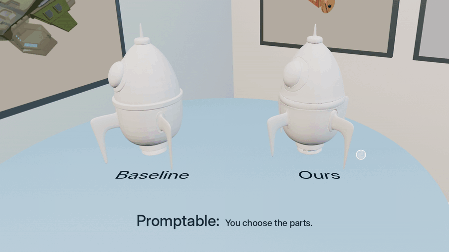
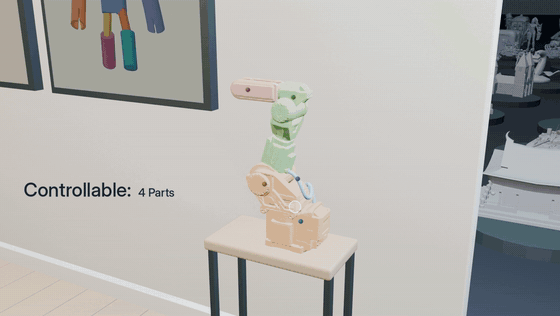
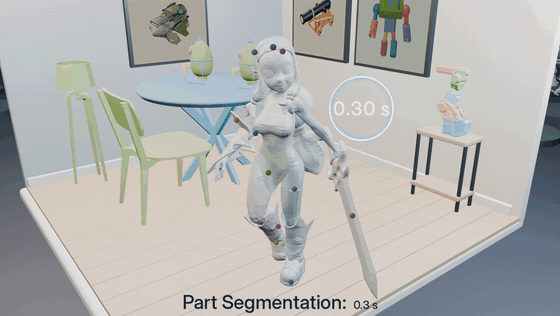

<div align="center">

<h1>Point2Part</h1>

<h3>Unified 3D Partitioning from Point Prompts</h3>

<p>
  <a href="https://henrytsui000.github.io/mypage/">Hao-Tang Tsui</a> &nbsp;·&nbsp;
  <a href="https://lucytuan.github.io/">Yu-Rou Tuan</a> &nbsp;·&nbsp;
  <a href="https://shirleymaxx.github.io/">Xiaoxuan Ma</a> &nbsp;·&nbsp;
  <a href="https://nicolasugrinovic.github.io/">Nicolás Ugrinovic</a> &nbsp;·&nbsp;
  <a href="https://sites.google.com/view/takaaki-shiratori/home">Takaaki Shiratori</a> &nbsp;·&nbsp;
  <a href="https://kriskitani.github.io/">Kris Kitani</a>
</p>

<p><b>Carnegie Mellon University</b></p>

<p>
  <a href="https://arxiv.org/"></a>
  <a href="https://henrytsui000.github.io/Point2Part/"></a>
  <a href="https://github.com/henrytsui000/Point2Part"></a>
</p>



<table>
<tr>
<td width="50%"></td>
<td width="50%"></td>
</tr>
<tr>
<td align="center"><b>You choose how many parts</b></td>
<td align="center"><b>Per-face labels in 0.3 s</b></td>
</tr>
</table>

</div>

---

> **TL;DR** &nbsp; Point at the parts you want. Point2Part returns them as a partition of
> the whole shape with no overlaps, no gaps.

Decomposition is solved jointly instead of one part at a time, so the output is
- **exclusive**: distinct parts have no volume overlap
- **exhaustive**: their union recovers the entire object. Both hold by construction.

One model covers three settings with no retraining: generating closed parts from a single
image, generating closed parts from a mesh, and labelling the faces of a mesh. Point
prompts are what you control, so the same shape can be split into as many or as few parts
as you want.

## 📢 News

- **[2026-09]** Project page and interactive gallery are live.

## 📋 TODO

- [x] Project Page
- [ ] Part Segmentation Inference
- [ ] Part Generation Inference
- [ ] Part Generation Training Code

## 📚 Citation

```bibtex
@article{tsui2026point2part,
  title   = {Point2Part: Unified 3D Partitioning from Point Prompts},
  author  = {Tsui, Hao-Tang and Tuan, Yu-Rou and Ma, Xiaoxuan and
             Ugrinovic, Nicol{\'a}s and Shiratori, Takaaki and Kitani, Kris},
  journal = {arXiv preprint arXiv:XXXX.XXXXX},
  year    = {2026}
}
```
