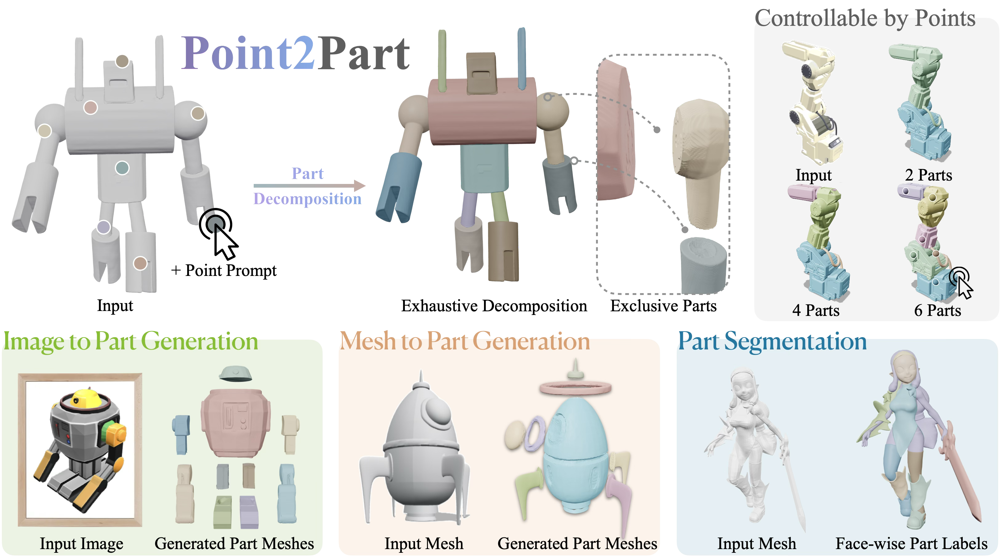
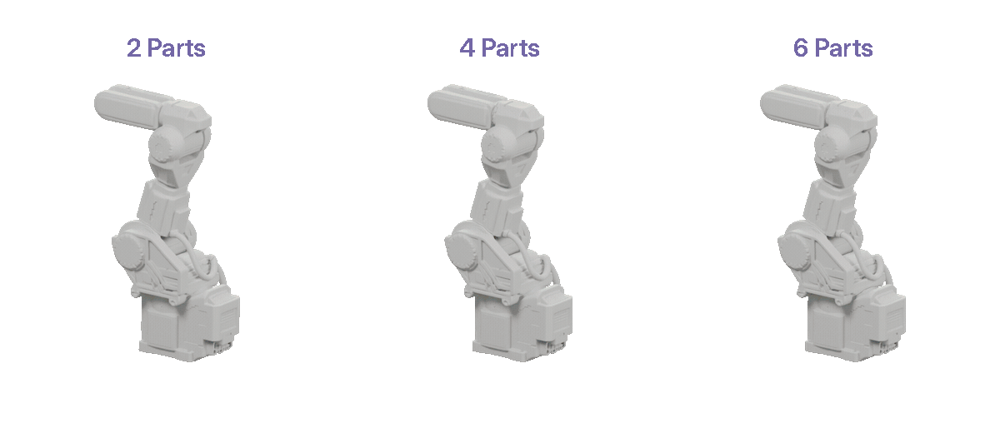
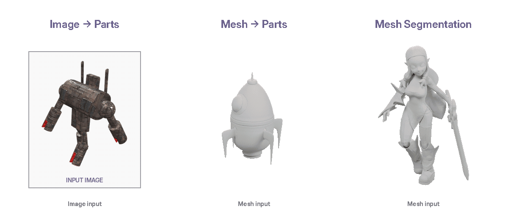

<div align="center">

# Point2Part

### Unified 3D Partitioning from Point Prompts

**[Hao-Tang Tsui](https://henrytsui000.github.io/mypage/)** ·
**[Yu-Rou Tuan](https://lucytuan.github.io/)** ·
**[Xiaoxuan Ma](https://shirleymaxx.github.io/)** ·
**[Nicolás Ugrinovic](https://nicolasugrinovic.github.io/)** ·
**[Takaaki Shiratori](https://sites.google.com/view/takaaki-shiratori/home)** ·
**[Kris Kitani](https://kriskitani.github.io/)**

Carnegie Mellon University

<br>

[](https://henrytsui000.github.io/Point2Part/)
[](https://arxiv.org/abs/2609.38180)
[](#code--models)

</div>

<br>

<p align="center">
  
</p>

<div align="center">

### Point to the parts you want.

**Point2Part** formulates 3D part decomposition as a **partition of the whole**:
users specify the desired parts with 3D point prompts, and the model jointly
decomposes the entire shape among them.

<br>

**Image → Parts** &nbsp;&nbsp;·&nbsp;&nbsp;
**Mesh → Parts** &nbsp;&nbsp;·&nbsp;&nbsp;
**Mesh → Segmentation**

</div>

---

## Overview

- **Point-prompted control**  
  Directly specify the desired decomposition with 3D point prompts.

- **Partition of the whole**  
  Parts are predicted jointly rather than independently, producing a complete and
  mutually exclusive decomposition by construction.

- **One model, three tasks**  
  Point2Part handles image-to-part generation, mesh-to-part generation, and mesh
  part segmentation within the same framework.

- **Strong part quality and compatibility**  
  Point2Part achieves state-of-the-art part quality while reducing inter-part
  penetration by more than an order of magnitude.

---

## Controllable Decomposition

Point2Part lets users control the
desired granularity simply by specifying point prompts.

<p align="center">
  
</p>

---

## Unified Tasks

<p align="center">
  
</p>

---

## Code & Models

Planned release:

- [ ] Pretrained checkpoints
- [ ] Mesh → Parts inference
- [ ] Image → Parts inference
- [ ] Mesh segmentation inference
- [ ] Evaluation scripts
- [ ] Training code

⭐ Star the repository to follow future releases.

---

## Acknowledgements

This work builds on [Hunyuan3D 2.1](https://github.com/Tencent-Hunyuan/Hunyuan3D-2.1),
[TripoSG](https://github.com/VAST-AI-Research/TripoSG) and
[HY3D-Bench](https://github.com/Tencent-Hunyuan/HY3D-Bench). We thank the authors for
releasing their work.

---

## Citation

If you find Point2Part useful, please consider citing:

```bibtex
@article{tsui2026point2part,
  title   = {Point2Part: Unified 3D Partitioning from Point Prompts},
  author  = {Tsui, Hao-Tang and Tuan, Yu-Rou and Ma, Xiaoxuan and
             Ugrinovic, Nicol{\'a}s and Shiratori, Takaaki and Kitani, Kris},
  journal = {arXiv preprint arXiv:2609.38180},
  year    = {2026}
}
```
